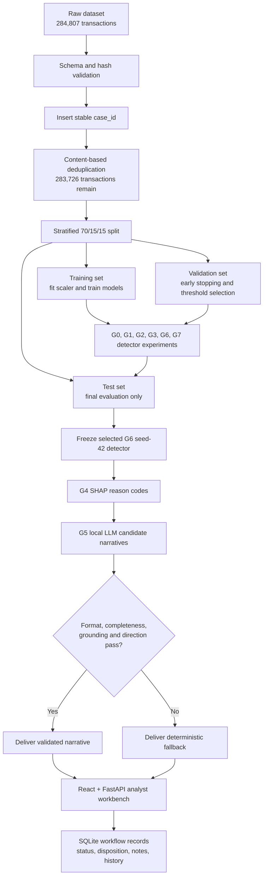
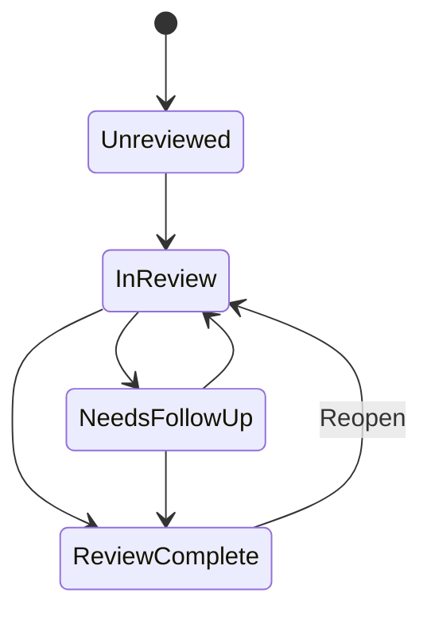

# Credit Card Fraud Detection FYP: Complete Beginner Walkthrough

**Project:** Evidence-Grounded Credit Card Fraud Detection and Review with Local LLM Explanations and Deterministic Guardrails  
**Student:** NG YI ZHEN (23076003)  
**Purpose of this document:** Explain the complete CP2 research system and analyst workbench from first principles, assuming the reader has no prior knowledge of machine learning, fraud detection, SHAP, LLMs, guardrails, React, or FastAPI.  
**Document status:** Supporting study guide. The CP2 report, source code, pinned run manifests, and immutable experiment artifacts remain the canonical sources of truth.  
**Pinned detector run:** `experiments/runs/2026-07-14_g6_seed42`  
**Pinned SHAP run:** `experiments/runs/2026-07-14_g4_seed42`  
**Pinned narrative run:** `experiments/runs/2026-07-14_g5_seed42`  
**Last updated:** 18 July 2026

> **Detector clarification**  
> Autoencoder-XGBoost configurations remain part of the detector benchmark, but the current analyst workbench is pinned to the G6 seed-42 cost-sensitive XGBoost detector because the autoencoder-derived variants did not demonstrate a clear detector-level advantage.

---

## 1. The project in one sentence

这个项目建立了一个可审计的信用卡诈骗调查原型：先用机器学习筛出值得人工调查的交易，再用 SHAP 提供模型证据，让本地 LLM 把证据转换成自然语言；但是系统不会直接信任 LLM，而是先运行确定性 guardrail，失败时自动退回安全的 reason-code explanation，最后由人类分析师在网页工作台中作出暂定处置。

> **Key English statement**  
> This project implements an auditable fraud-review pipeline in which a frozen machine-learning detector identifies transactions for review, SHAP produces signed model evidence, a local LLM generates a candidate narrative, and deterministic guardrails either approve the narrative or replace it with a safe reason-code fallback before it reaches the analyst.

项目不是让 LLM 判断诈骗。不同组件有清楚的责任边界：

| Component | Responsibility | What it must not do |
|---|---|---|
| XGBoost detector | 计算交易的诈骗风险排序分数 | 生成自然语言或作出最终业务决定 |
| Autoencoder experiments | 学习正常交易的压缩表示或重建误差 | 直接证明交易一定是诈骗 |
| SHAP | 解释哪些输入推动了模型输出 | 声称现实中的因果关系 |
| Local LLM | 把已经冻结的 reason codes 转成候选叙述 | 添加、删除或改变模型证据 |
| Guardrail validator | 检查候选叙述是否符合证据和模板 | 猜测模型原本想表达什么 |
| Human analyst | 调查案件并记录暂定处置 | 把模型输出当成无条件的事实 |

---

## 2. End-to-end system map



从数据进入项目到分析师看到一个案件，完整流程可以分成十二步：

1. 验证原始 CSV 的文件 hash、行数和字段结构。
2. 为每条原始交易加入稳定的 `case_id`。
3. 按内容去除重复记录。
4. 在任何 scaling、SMOTE 或 Autoencoder 训练之前切分数据。
5. 只在训练数据上拟合 StandardScaler。
6. 分别运行 G0、G1、G2、G3、G6 和 G7 detector 实验。
7. 使用 validation set 进行 early stopping 和 threshold selection。
8. 冻结模型与 threshold 后，在 test set 进行最终评估。
9. 选择并冻结 G6 seed 42，供 G4、G5 和工作台使用。
10. G4 使用 SHAP 为每个 flagged case 生成 top reason codes。
11. G5 使用本地 LLM 生成候选叙述，并使用 guardrail 决定交付或 fallback。
12. React + FastAPI 工作台读取冻结 artifact，让分析师进行调查和记录决定。

> **Key English statement**  
> The pipeline separates detection, explanation, language generation, validation, and human decision-making. This separation is intentional: failure in the LLM layer must not alter the frozen detector output or prevent the analyst from accessing the underlying reason codes.

---

## 3. What problem is the project solving?

信用卡公司每天可能处理大量交易。由于诈骗比例很低，人工逐笔查看所有交易并不现实。因此，第一层问题是：

> 怎样把少量值得人工注意的交易排到队列前面？

机器学习 detector 可以产生风险排序，但只有一个分数通常不能帮助分析师理解模型。于是第二层问题是：

> 模型为什么把这一笔排得这么高？

SHAP 可以回答模型层面的贡献问题，但它通常输出技术字段，例如 `V14 increases risk`。这对于没有机器学习背景的使用者仍不够自然。于是第三层问题是：

> 能否把结构化模型证据转成容易阅读的叙述？

LLM 可以生成流畅文字，但可能编造或改变证据。于是项目真正重点进入第四层问题：

> 当 LLM 被用于解释层时，怎样测量、检测并阻止不忠实叙述进入分析师界面？

这也是项目最有研究价值的部分。Detector experiment 回答模型表现；G5 experiment 回答语言层怎样被约束和审计。

> **Key English statement**  
> The central research problem is not merely whether an LLM can produce readable text. It is whether generated fraud narratives can be constrained, evaluated, rejected when unsupported, and safely replaced without compromising the detector or the analyst workflow.

---

## 4. The dataset

### 4.1 Source data

项目使用公开的 European Credit Card Fraud Detection Dataset，也常被称为 ULB/Kaggle credit-card fraud dataset。

原始数据包括：

- 284,807 笔交易；
- 492 笔诈骗交易；
- 诈骗比例约 0.1727%；
- 30 个 detector input features；
- 1 个 ground-truth label `Class`。

原始 CSV 的 SHA256 是：

```text
76274b691b16a6c49d3f159c883398e03ccd6d1ee12d9d8ee38f4b4b98551a89
```

SHA256 可以理解为文件的数字指纹。如果 CSV 中任何一个字符发生变化，hash 通常也会变化。项目使用 hash 确保实验和工作台读取的是预期数据文件，而不是另一个同名 CSV。

> **Key English statement**  
> The raw dataset is pinned by SHA256 so that the reported experiments and the dashboard can verify that they consume the intended source file.

### 4.2 Columns

| Column | Meaning | Important limitation |
|---|---|---|
| `Time` | 从第一条交易开始经过的秒数 | 不是 calendar timestamp |
| `Amount` | 交易金额 | 数据集没有说明货币单位 |
| `V1`-`V28` | PCA 匿名特征 | 不知道真实业务含义 |
| `Class` | 0 = legitimate, 1 = fraud | 只用于研究评估，不给 operational analyst 看 |

### 4.3 Why the features are anonymous

V1-V28 已经经过 PCA 变换。PCA 会把原始特征重新组合成一组新的数值维度。这有助于隐私保护，但会失去业务语义。

因此，系统可以合法表达：

> V14 made a positive contribution to the model output.

但不能表达：

> V14 means that the merchant is suspicious.

项目没有证据证明 V14 是商户、地点、设备、身份或消费习惯。擅自把匿名字段改成业务字段会构成 fabricated interpretation。

> **Key English statement**  
> The PCA components support model-level attribution but not business-semantic interpretation. A positive SHAP value for V14 indicates that V14 pushed the model output towards fraud; it does not reveal what real-world behaviour V14 represents.

### 4.4 What information is missing

公开数据没有提供：

- merchant name or merchant category；
- customer identity or account profile；
- device fingerprint；
- location；
- payment channel；
- previous transaction history；
- confirmed investigation notes；
- operational fraud-loss amount。

所以当前工作台能够模拟的是 **evidence review workflow**，而不是完整银行调查资料系统。

---

## 5. Stable case identity and deduplication

### 5.1 Why `case_id` is needed

数据会经过多个阶段：split、preprocessing、prediction、SHAP、LLM narrative 和 dashboard。如果只依赖 DataFrame 的当前行号，排序或过滤后就可能把一个人的 explanation 接到另一笔交易上。

项目在去重前为原始行加入：

```text
case_id = original row position
```

从此以后，不同 artifact 使用 `case_id` 进行 join。

> **Key English statement**  
> A stable `case_id` is assigned before deduplication and propagated through detector predictions, SHAP reason codes, narratives, and dashboard workflow records. Cross-stage joins are performed by identifier rather than row position.

### 5.2 Deduplication

去重比较原始交易内容，但排除 `case_id`。否则两条内容完全相同、case ID 不同的记录永远不会被识别为重复。

去除 1,081 条重复记录后：

| Item | Count |
|---|---:|
| Remaining transactions | 283,726 |
| Remaining fraud transactions | 473 |
| Fraud rate | 0.1667% |

去重不是为了让结果更漂亮，而是避免相同内容同时进入不同 split，使测试结果受到重复记录影响。

---

## 6. Train, validation and test split

### 6.1 Beginner analogy

可以把三个集合想成：

- Training set：练习题；
- Validation set：模拟考试；
- Test set：最终考试。

模型可以反复从 training set 学习，并使用 validation set 决定什么时候停止、哪个 threshold 更合适。Test set 应该在设计冻结后才使用。

### 6.2 Exact seed-42 split

| Split | Total rows | Fraud rows | Purpose |
|---|---:|---:|---|
| Train | 198,608 | 331 | 拟合 scaler 和模型 |
| Validation | 42,559 | 71 | Early stopping 和 threshold selection |
| Test | 42,559 | 71 | 最终评估 |

### 6.3 Stratification

因为诈骗只有约 0.17%，普通随机切分可能让不同集合的诈骗比例差别太大。Stratified split 让各集合尽量保持相近的类别比例。

代码同时检查：

- 三个 split 的 case IDs 不相交；
- 三个 split 合并后覆盖全部建模数据；
- 标签比例保持合理；
- case ID 没有进入 detector feature matrix。

> **Key English statement**  
> A stratified 70/15/15 split is created before scaling, resampling, or autoencoder training. The split contract verifies that case identifiers are disjoint across partitions and excluded from the feature matrix.

---

## 7. Data leakage

Data leakage 指模型训练过程获得了原本只应该属于未来或测试阶段的信息。泄漏后的模型可能得到很高分，但不能代表真实泛化能力。

### 7.1 Scaling leakage

StandardScaler 需要计算每个 feature 的训练平均值和标准差。

正确：

```text
fit scaler on training set
transform training set
transform validation set using the same scaler
transform test set using the same scaler
```

错误：

```text
fit scaler on the complete dataset before splitting
```

后者会让 training transformation 间接看到 validation 和 test distribution。

### 7.2 SMOTE leakage

SMOTE 只能应用于 training partition。先对全数据做 SMOTE 再切分，可能让高度相似的合成样本进入 training 和 test。

### 7.3 Autoencoder leakage

Autoencoder 只能从 training set 中的 legitimate rows 学习正常交易。它不能使用 test legitimate rows，也不能提前接触 test fraud rows。

### 7.4 Threshold leakage

Threshold 只能在 validation set 决定。不能根据 test F1 反复修改 threshold，然后仍把该 test F1 当作独立结果。

> **Key English statement**  
> All transformations that learn from data are fitted using training data only. SMOTE is restricted to the training partition, the autoencoder is fitted on legitimate training rows, and the classification threshold is selected on validation data before final test evaluation.

---

## 8. Standardisation

不同特征的数值尺度可能相差很大。例如 Amount 可能是几十或几百，而某个 PCA component 可能集中在较小范围。StandardScaler 进行：

```text
standardised value = (original value - training mean) / training standard deviation
```

Standardisation 不会创造新信息，也不会平衡类别。它只是让输入尺度更一致，尤其有利于 Autoencoder 的优化。

需要强调：XGBoost 本身通常不强制要求 scaling，但项目为了统一实验矩阵和 Autoencoder pipeline，使用训练集拟合的 scaler 处理输入。

---

## 9. Why accuracy is not the main metric

如果模型把每条交易都预测成正常，accuracy 仍然约为：

```text
99.83%
```

但它会漏掉全部诈骗，所以没有实际价值。

### 9.1 Precision

```text
Precision = TP / (TP + FP)
```

它回答：所有警报中，有多少是真的诈骗？

Precision 高意味着分析师较少把时间浪费在假警报上。

### 9.2 Recall

```text
Recall = TP / (TP + FN)
```

它回答：所有真实诈骗中，有多少被模型发现？

Recall 高意味着模型漏掉的诈骗较少。

### 9.3 F1 score

```text
F1 = 2 * Precision * Recall / (Precision + Recall)
```

F1 在 precision 和 recall 之间取得综合平衡。

### 9.4 Average Precision

Average Precision, AP, 综合不同 threshold 下 precision-recall curve 的表现，适合严重类别不平衡任务。

部分早期 artifact 字段名使用 `auc_pr`，但实际代码调用 `average_precision_score`，因此报告中使用 AP 更准确。

### 9.5 ROC-AUC

ROC-AUC 衡量模型把正类排在负类前面的能力。但正常交易数量非常多时，即使 false-positive rate 很小，实际 false positives 也可能不少。因此本项目不会只用 ROC-AUC 作为主结论。

### 9.6 Precision@100 and Recall@100

这两个指标把分析师容量纳入考虑：

- Precision@100：排名前 100 笔中有多少比例是真诈骗；
- Recall@100：所有真实诈骗中有多少出现在前 100 笔。

> **Key English statement**  
> Accuracy is not a meaningful headline metric for a dataset with approximately 0.17% fraud. The study therefore prioritises Average Precision, precision, recall, F1, and capacity-oriented metrics such as Precision@100 and Recall@100.

---

## 10. XGBoost from first principles

XGBoost 是 supervised learning model。训练时它看到输入特征和真实标签，学习怎样把交易排序为较低或较高风险。

### 10.1 Decision trees

一棵简化的树可能学习：

```text
Is V14 below a learned cut-off?
  Yes -> inspect V12
  No  -> inspect V4
```

真实模型包含很多棵树。后面的树尝试修正前面模型仍然犯的错误，这叫 boosting。

### 10.2 Current experiment configuration

主要配置包括：

- approximately 300-500 estimators, depending on the group configuration；
- `max_depth = 6`；
- `learning_rate` 按实验配置变化；
- `subsample` 和 `colsample_bytree` 控制训练抽样；
- histogram tree method；
- validation Average Precision for monitoring；
- early stopping after 30 non-improving rounds。

### 10.3 Model score versus calibrated probability

代码使用 `predict_proba(... )[:, 1]` 产生 0 到 1 的数值。但是本项目没有完成 probability calibration study，而且 G6 使用 class weighting。因此网页不应把 0.999 解释成现实中的 99.9% 诈骗概率。

更安全的表达是：

> The detector score is used for ranking and thresholding; it is not presented as a calibrated real-world fraud probability.

---

## 11. The Autoencoder

### 11.1 Basic idea

Autoencoder 是 neural network，尝试把输入压缩后再重建。

```text
30 input features
        ↓
20 hidden units
        ↓
10 bottleneck units
        ↓
20 hidden units
        ↓
30 reconstructed features
```

项目配置：

- 30-dimensional input；
- 20-unit ReLU encoder layer；
- 10-unit ReLU bottleneck；
- 20-unit decoder layer；
- 30-unit linear output；
- Adam optimiser；
- learning rate 0.001；
- mean squared error loss；
- maximum 50 epochs；
- batch size 256；
- early stopping patience 5。

### 11.2 Why train only on legitimate transactions?

项目希望 Autoencoder 学习“正常交易空间”。如果正常交易与学习到的模式相近，模型通常能较好重建；如果输入偏离正常模式，重建误差可能较大。

这并不意味着 reconstruction error 高就一定是诈骗。合法的罕见交易也可能有较高 error。

### 11.3 Reconstruction error

```text
reconstruction_error = mean((input - reconstructed_input)^2)
```

G2 和 G3 把这个单一数值附加到原始 30 个特征之后，形成 31-dimensional XGBoost input。

### 11.4 Latent features

G7 读取 bottleneck 中的 10 个 activations，作为 latent representation：

```text
30 original features + 10 latent features = 40 features
```

### 11.5 What the Autoencoder does not prove

Autoencoder 不是独立的 fraud ground-truth generator。它只能提供一种 representation 或 anomaly-related signal。是否有价值必须通过下游 test results 判断，不能因为结构复杂就假定更好。

> **Key English statement**  
> The autoencoder is trained only on legitimate training transactions and is used to derive either a reconstruction-error feature or ten bottleneck features. These representations are evaluated as inputs to XGBoost rather than treated as independent fraud decisions.

---

## 12. Class imbalance treatments

### 12.1 No imbalance treatment

G0、G2 和 G7 不进行 SMOTE 或 class weighting。它们提供比较基线。

### 12.2 SMOTE

SMOTE 在少数类训练样本之间插值，创建 synthetic minority samples。

优势：

- 让训练阶段看到更多少数类区域；
- 可能帮助模型学习 fraud boundary。

限制：

- 不会产生新的真实诈骗证据；
- 可能产生不够真实的中间样本；
- 只能用于训练集；
- 可能提高 variance 或降低 precision。

### 12.3 Cost-sensitive learning

G6 不创建合成交易，而是在训练 loss 中提高诈骗样本错误的成本。

seed-42 training partition 大约有：

```text
198,277 legitimate rows
331 fraud rows
scale_pos_weight ≈ 198,277 / 331 ≈ 599
```

这告诉 XGBoost：少数类错误需要更大惩罚。

> **Key English statement**  
> SMOTE changes the training sample distribution by synthesising minority examples, whereas cost-sensitive XGBoost retains the observed training rows and changes the loss contribution assigned to fraud errors.

---

## 13. Experimental groups

| Group | Detector input | Imbalance method | Research purpose |
|---|---|---|---|
| G0 | 30 original features | None | Original-feature baseline |
| G1 | 30 original features | Train-only SMOTE | Test oversampling effect |
| G2 | Original + reconstruction error | None | Test AE anomaly signal |
| G3 | Original + reconstruction error | Train-only SMOTE | Test AE signal with SMOTE |
| G6 | 30 original features | `scale_pos_weight` | Test cost-sensitive learning |
| G7 | Original + 10 latent features | None | Test AE representation features |
| G4 | Frozen selected detector | Not a new detector | Produce signed SHAP reason codes |
| G5 | Frozen G4 evidence | Not a detector | Evaluate LLM narrative delivery |

每个 detector group 使用 seeds 42-46，总共形成 30 个 detector runs。

G4 和 G5 不应与 G0-G7 detector groups 直接作为相同类型模型比较。G4 是 explanation stage，G5 是 narrative stage。

---

## 14. Detector results

五个 seeds 的 mean test results：

| Group | Mean AP | Mean Precision | Mean Recall | Mean F1 |
|---|---:|---:|---:|---:|
| G0 | 0.852891 | 0.930238 | 0.788732 | 0.850707 |
| G1 | 0.840457 | 0.946300 | 0.794366 | 0.863342 |
| G2 | 0.853707 | 0.937490 | 0.814085 | 0.870054 |
| G3 | 0.816870 | 0.904594 | 0.763380 | 0.824657 |
| G6 | 0.855214 | 0.955540 | 0.769014 | 0.849037 |
| G7 | 0.854767 | 0.925863 | 0.816901 | 0.866858 |

### 14.1 Correct interpretation

- G6 has the numerically highest mean AP；
- G6 has the highest mean precision；
- G7 has the highest mean recall；
- G2 has the highest mean F1；
- G3 has the lowest AP and largest variability；
- leading AP differences are small。

例如：

```text
G2 mean AP - G0 mean AP = +0.000816
G6 mean AP - G0 mean AP = +0.002323
```

这些差异不足以支持夸张的 superiority claim。

### 14.2 The honest Autoencoder conclusion

不能说 Autoencoder 明显提升 detector，因为 G2/G7 的 AP 与 G0/G6 非常接近。合理结论是：

> **Key English statement**  
> Autoencoder-derived features did not demonstrate a clear and consistent detector-level advantage over the original-feature baselines on this dataset.

这是有效研究结果。研究不要求复杂方法一定胜出；诚实呈现 null or negative finding 比强行制造 improvement 更可信。

---

## 15. The frozen detector used by the dashboard

当前工作台锁定：

```text
G6, seed 42
```

即：

```text
Original features + cost-sensitive XGBoost
```

### 15.1 Important distinction

Autoencoder 已经在 G2、G3、G7 完成训练和评估，但当前网页使用的最终冻结 detector **不包含 Autoencoder**。

> **Key English statement**  
> Autoencoder-XGBoost variants were implemented and evaluated as central experimental groups. However, the operational workbench is pinned to the frozen G6 seed-42 cost-sensitive XGBoost run because the autoencoder-derived variants did not show a clear detector-level advantage.

### 15.2 Exact frozen-run performance

| Metric | G6 seed-42 result |
|---|---:|
| Validation AP | 0.877447 |
| Test AP | 0.820176 |
| Test ROC-AUC | 0.977399 |
| Frozen threshold | 0.989038 |
| Precision | 0.980392 |
| Recall | 0.704225 |
| F1 | 0.819672 |
| True positives | 50 |
| False positives | 1 |
| False negatives | 21 |
| True negatives | 42,487 |

### 15.3 Plain-language interpretation

Test set 包含 71 个真实 frauds。模型 flag 了 51 笔：

- 50 笔是真的 fraud；
- 1 笔是 legitimate false alert；
- 21 笔 fraud 没有被 flag。

```text
Precision = 50 / 51 = 98.04%
Recall = 50 / 71 = 70.42%
```

正确表达：

> The frozen workbench detector produced a high-precision review queue, but it did not identify all fraud cases and missed 21 of the 71 fraud transactions in its test partition.

错误表达：

> The system detects almost all fraud.

### 15.4 Mean results versus one frozen run

五-seed mean 代表不同 split 下的平均稳定性；G6 seed42 代表网页实际读取的精确 artifact。平均表现和单次运行不同并不矛盾。

---

## 16. Threshold selection

XGBoost 产生连续 score。系统需要 threshold 决定哪些交易进入 Queue。

项目在 validation set 上计算 precision-recall curve，并选择 validation F1 最大的 threshold。实现特别处理了 sklearn curve 中最后一个没有对应 threshold 的 precision/recall point，避免 off-by-one 错误。

冻结的 G6 seed42 threshold 是：

```text
0.989038
```

这个 threshold 体现高 precision、较低 recall 的 trade-off。它不是唯一可能的业务 threshold。真实银行可能根据：

- 调查团队容量；
- false-positive cost；
- missed-fraud loss；
- customer friction；
- regulatory policy；

选择其他 threshold。

> **Key English statement**  
> The threshold was selected on validation data by maximising F1 and was frozen before test evaluation. It is an experimental operating point rather than a universally optimal banking policy.

---

## 17. G4 SHAP explanation layer

### 17.1 What SHAP answers

SHAP 回答：

> 对这一笔具体交易，哪些 feature contribution 把冻结模型输出推高或拉低？

正 SHAP value：推动输出向 fraud。  
负 SHAP value：推动输出向 legitimate。

### 17.2 What SHAP does not answer

SHAP 不能证明：

- feature 在现实中导致诈骗；
- feature 是犯罪行为；
- 匿名 component 对应某个业务概念；
- 交易最终一定是 fraud。

> **Key English statement**  
> SHAP explains the contribution of an input to the model output. It is a model attribution method, not a causal explanation of fraud.

### 17.3 G4 implementation

G4：

1. 加载精确冻结的 G6 seed42 model；
2. 使用同一 dataset、split 和 scaler 重建 test matrix；
3. 加载保存的 predictions，而不是重新决定哪些交易被 flag；
4. 使用 `shap.TreeExplainer` in raw-margin space；
5. 按绝对 SHAP magnitude 选择 top three non-zero contributions；
6. 保留 contribution sign；
7. 按 `case_id` join；
8. 保存 reason-code artifact。

### 17.4 Global SHAP

另一个 deterministic 2,000-row test sample 用于 global feature importance。主要全局 features 包括：

1. V14；
2. V4；
3. V12；
4. V3；
5. V11。

### 17.5 Why V14 appears frequently

V14 经常是 top signal，因为冻结模型确实大量依赖它。UI 不应为了看起来丰富而隐藏或轮换 feature。正确做法是承认公开数据的匿名性限制。

---

## 18. G5 local LLM narrative layer

### 18.1 Role of the LLM

LLM 的输入不是完整交易，也不是训练数据。它接收已经选择好的 reason codes，并尝试按照模板转换成叙述。

LLM 不会：

- 重新运行 detector；
- 修改 threshold；
- 计算 SHAP；
- 查看 ground-truth `Class`；
- 决定 analyst disposition；
- 把一个未 flagged case 变成 flagged。

> **Key English statement**  
> The LLM is an optional evidence-to-language component. It does not participate in fraud scoring, thresholding, SHAP computation, or final case disposition.

### 18.2 Local Ollama

G5 使用本地 Ollama 运行 Llama 3 8B。主要动机：

- evidence stays on the local machine；
- no third-party cloud API is required；
- the model version can be pinned；
- live demonstration remains possible without external data transfer。

Local deployment reduces disclosure, but does not solve hallucination or faithfulness by itself。

### 18.3 Historical research serializer

历史 G5 experiment 输入包含：

- Case ID；
- coarse risk level；
- feature name；
- direction；
- rank。

不包含：

- Amount；
- Time；
- exact detector score；
- ground-truth label；
- SHAP magnitude；
- exact feature values。

### 18.4 Current operational serializer

当前 dashboard live regeneration 进一步排除 Case ID，只发送：

- coarse risk bucket；
- rank；
- anonymous feature name；
- direction。

当前 live path 排除：

- Case ID；
- Amount；
- Time；
- exact score；
- exact values；
- SHAP magnitude；
- `y_true`。

这两个版本必须分开描述。不能把当前更严格的 live serializer 倒写成历史 G5 experiment 的事实。

> **Key English statement**  
> The historical G5 evaluation used a research serializer that included the case identifier. The current operational live path uses a stricter data-minimised serializer that excludes the case identifier, amount, elapsed time, exact score, feature values, SHAP magnitudes, and ground truth.

---

## 19. Strict and simple prompt arms

### 19.1 Strict arm

Strict prompt 要求：

- 只能使用 listed features；
- 所有 listed features 必须出现；
- 每个 feature exactly once；
- direction 不得改变；
- 不能使用 exact numbers；
- 不能增加 unsupported facts；
- 使用固定 section structure；
- ACTION 使用固定 manual-review wording。

### 19.2 Simple arm

Simple prompt 保持基本模板形状，但去掉大部分详细 evidence rules。这样两组输出仍可比较，同时可以测量详细约束的作用。

### 19.3 Why both arms are necessary

如果只运行 strict prompt，得到低 violation rate，只能说明这个设置下系统表现怎样；没有对照就难以知道详细 prompt rules 是否真正重要。

> **Key English statement**  
> The strict and simple arms preserve a comparable output shape while varying the strength of evidence constraints. This provides a controlled comparison of prompt discipline rather than comparing unrelated tasks.

---

## 20. Guardrail OFF and ON policies

### 20.1 OFF policy

OFF policy 不代表关闭 detector。它表示：

> 测量 LLM raw output 本身包含多少可检测违规，不应用 validate-or-fallback delivery policy。

### 20.2 ON policy

ON policy 把同一个 raw output 原封不动送入 validator：

- all checks pass -> deliver narrative；
- any check fails -> reject narrative and deliver fallback。

### 20.3 Why paired outputs matter

OFF 和 ON 使用同一批 raw outputs，而不是分别调用 LLM。这样观察到的交付差异来自 policy，不是生成随机性。

> **Key English statement**  
> The OFF and ON analyses are paired: the same raw generation is measured directly and then passed unchanged through the validate-or-fallback policy. No regeneration is performed between the two conditions.

---

## 21. Deterministic narrative guardrails

### 21.1 Format check

检查：

- required headings；
- narrative sentence structure；
- evidence bullet syntax；
- action line；
- unauthorised numeric claims。

### 21.2 Completeness check

检查：

- every expected feature appears；
- no expected evidence is omitted；
- bullet order matches the reason-code order。

### 21.3 Grounding check

检查：

- no invented feature；
- no unsupported feature token；
- statements belong to accepted closed grammar；
- all evidence references originate from G4 input。

### 21.4 Direction check

检查 LLM 是否保留每个 feature 的 SHAP direction。

输入：

```text
V14 increases risk
```

违规输出：

```text
V14 decreases risk
```

### 21.5 Why deterministic checks

项目不使用另一个 LLM 来判断第一个 LLM 是否正确，因为这样会把 faithfulness decision 交给另一个不稳定生成模型。

确定性 validator 的优点：

- repeatable；
- testable；
- auditable；
- identical input produces identical decision；
- failure reason can be shown directly。

限制是语言范围较窄。语义正确但不属于允许 grammar 的 paraphrase 可能被拒绝。

> **Key English statement**  
> The validator is intentionally deterministic and closed-grammar. It provides repeatable enforcement of known evidence constraints, but it is not a general semantic judge of unrestricted natural language.

---

## 22. Fallback behaviour

任何 guardrail 失败，系统不会自动改写原文。它会拒绝候选叙述，并从 reason codes 生成 deterministic fallback。

同样地，如果 Ollama：

- is not running；
- times out；
- returns an error；

系统仍然显示 reason codes，而不是让案件页面失败。

Fallback 的意义：

1. LLM 不是 single point of failure；
2. analyst 始终能看到原始模型证据；
3. rejected text 不会被无声修补；
4. failure 可以被记录和演示。

> **Key English statement**  
> The deterministic reason-code renderer is the trusted fallback. LLM unavailability or validation failure degrades the presentation layer but does not remove the underlying explanation or change the detector decision.

---

## 23. Validator calibration

版本化 calibration corpus 包含：

| Corpus type | Count | Purpose |
|---|---:|---|
| Adversarial attacks | 330 | 测试已知绕过和错误形式 |
| Faithful controls | 318 | 测试合法叙述会不会被误拒绝 |
| Total | 648 | Validator calibration |

攻击覆盖 15 类，faithful controls 覆盖 17 类。

结果：

- attacks intercepted: 330/330；
- Wilson 95% CI: 98.85%-100%；
- faithful controls accepted: 318/318；
- observed false rejection: 0/318；
- false-rejection Wilson 95% CI: 0%-1.19%。

正确结论：

> Within the versioned, template-constrained calibration corpus, the validator intercepted all 330 adversarial samples and accepted all 318 faithful controls.

错误结论：

> The validator understands all English and is 100% accurate.

校准语料是 synthetic and template-constrained，不等于开放世界语言。

---

## 24. Final G5 results

### 24.1 Strict prompt

| Outcome | Result |
|---|---:|
| Cases | 51 |
| Raw outputs with any detected violation | 2 |
| Detected violation rate | 3.92% |
| Wilson 95% CI | 1.08%-13.22% |
| Original narratives delivered | 49 |
| Fallbacks delivered | 2 |

### 24.2 Simple prompt

| Outcome | Result |
|---|---:|
| Cases | 51 |
| Raw outputs with any detected violation | 51 |
| Detected violation rate | 100% |
| Wilson 95% CI | 93%-100% |
| Original narratives delivered | 0 |
| Fallbacks delivered | 51 |

### 24.3 Check-level observations

Strict arm：

- 2/51 failed format；
- 2/51 failed grounding；
- 2/51 failed direction；
- 0/51 failed completeness。

Simple arm：

- 51/51 failed format；
- 51/51 failed grounding；
- 51/51 failed direction；
- 2/51 failed completeness。

### 24.4 Correct interpretation

可以说：

> Under the evaluated prompt, model and case set, the strict arm produced substantially more deliverable narratives than the simple arm.

可以说：

> The validate-or-fallback policy prevented all detected violations from being delivered as accepted LLM narratives.

不能说：

> The delivered narratives contained zero possible errors.

因为 delivered violation rate 为零是 policy **by construction**：有 detected violation 的文本本来就不会被交付。Validator 仍可能漏掉未知错误。

### 24.5 Further limitations

- only 51 flagged cases from one frozen split；
- eight cases were exposed during development；
- no completed human blind audit；
- no analyst usability study；
- no direct readability comparison against deterministic renderer；
- no claim about unrestricted prose。

---

## 25. Why not use only a deterministic normaliser or renderer?

这是一个重要而合理的问题。

如果目标只是：

> 把三个 reason codes 安全地写成固定句子。

那么 deterministic renderer 通常更：

- reliable；
- fast；
- cheap；
- easy to test；
- easy to audit。

例如程序可以直接产生：

```text
The transaction was flagged for manual review. V14 and V12 increased the model output, while V10 decreased it.
```

不需要 LLM。

### 25.1 Why keep the LLM experiment?

项目研究的问题不是“系统必须依赖 LLM”，而是：

> 如果组织希望使用生成式语言层，怎样量化它的风险，并建立拒绝和 fallback 边界？

Simple prompt 51/51 的 detected violation 说明不能因为输出流畅就假定忠实。Strict arm 和 guardrail 展示怎样提高可交付性。

### 25.2 What has not been proven

当前项目没有证明：

- LLM 比 deterministic renderer 更易读；
- LLM 提高 analyst speed；
- LLM 改善 investigation accuracy；
- LLM 值得额外 latency and complexity。

因此最诚实的部署结论是：

> **Key English statement**  
> A deterministic renderer may remain the safer operational default. The LLM is evaluated as an optional narrative layer whose outputs must be validated and may be replaced by the deterministic fallback.

---

## 26. Dashboard architecture

### 26.1 Frontend

技术：React + TypeScript + Vite。

职责：

- render Queue；
- render Investigation view；
- render Narrative Assurance；
- render Model and Policy Monitor；
- collect workflow input；
- call backend APIs；
- display loading, empty and error states。

Frontend 不直接加载 XGBoost model，也不在浏览器中计算 SHAP。

### 26.2 Backend

技术：FastAPI + Python。

职责：

- load and validate pinned artifacts；
- expose case APIs；
- return transaction context；
- return recorded SHAP and narrative evidence；
- run optional local LLM regeneration；
- call the real validator；
- update workflow records；
- enforce provenance and concurrency rules。

### 26.3 Workflow database

SQLite 只保存可写 workflow state：

- case status；
- provisional disposition；
- analyst note；
- revision number；
- evidence fingerprint；
- activity events。

它不会修改研究 artifact。

> **Key English statement**  
> The workbench is a read-only consumer of immutable research artifacts and maintains analyst workflow state in a separate SQLite store. Analyst actions cannot modify detector predictions, SHAP evidence, narrative experiments, or reported metrics.

---

## 27. Immutable evidence plane and writable workflow plane

### 27.1 Immutable evidence plane

包括：

- dataset manifest；
- split assignments；
- scaler；
- XGBoost model；
- Autoencoder artifact where applicable；
- threshold；
- predictions；
- metrics；
- SHAP reason codes；
- narratives；
- figures；
- run manifests。

### 27.2 Writable workflow plane

包括：

- `unreviewed`；
- `in_review`；
- `needs_follow_up`；
- `review_complete`；
- provisional disposition；
- analyst notes；
- event history。

两个平面分开，避免分析师操作污染研究证据。

---

## 28. Artifact provenance

每个 run directory 记录：

- resolved configuration；
- metrics；
- predictions；
- split summary；
- split assignments；
- environment information；
- model files；
- source hashes；
- artifact hashes；
- row counts；
- run manifest。

依赖链：

```text
Dataset and split
    ↓
Detector run
    ↓
G4 SHAP run
    ↓
G5 narrative run
    ↓
Results manifest and dashboard
```

工作台配置 pin exact run paths，不使用模糊的 `latest` glob。如果 hash 或 upstream reference 不一致，加载应 fail closed。

### 28.1 Meaning of “verified”

Source chain verified 表示：

> 当前配置中的文件与 manifest 记录的 hash and relationship 一致。

它不表示：

- model is fair；
- model is legally approved；
- prediction is correct；
- deployment is secure；
- data is representative of all populations。

> **Key English statement**  
> Provenance verification establishes artifact identity and lineage; it does not establish model fairness, causal validity, regulatory approval, or production readiness.

---

## 29. Evidence fingerprint and stale workflow protection

Evidence fingerprint 根据 detector、G4 和 G5 run identity 与 manifest hash 生成。

如果模型或 explanation artifact 被替换，fingerprint 改变。过去基于旧 evidence 的 workflow decision 不应该自动显示为仍然适用于新 evidence。

这解决：

> 模型已更换，但网页仍保留旧案件“review complete”，让人误以为新模型已被审查。

---

## 30. Optimistic concurrency

每个 workflow record 有 `revision`。

例子：

1. Window A 读取 revision 3；
2. Window B 也读取 revision 3；
3. A 保存，record 变成 revision 4；
4. B 使用旧 revision 3 保存；
5. Backend 返回 HTTP 409 conflict。

这样可以避免两个分析师或两个浏览器窗口无声覆盖彼此笔记。

> **Key English statement**  
> Workflow updates use optimistic concurrency. A stale revision is rejected with a conflict response rather than silently overwriting a newer analyst action.

---

## 31. Analyst workflow states

主要状态：



完成案件必须选择 provisional disposition：

- suspicious；
- not suspicious；
- inconclusive。

这些是分析师的暂定本地决定，不是 dataset ground truth。

---

## 32. Why the analyst cannot see `y_true`

研究人员需要 `Class` 计算 metrics，但真实调查过程中，分析师通常不知道最终答案。

如果 UI 直接显示：

```text
Actual label: fraud
```

分析师就不是在审查证据，而是在看答案。这会产生 hindsight leakage。

因此：

- evaluation artifact may contain `y_true`；
- operational case API excludes `y_true`；
- analyst disposition is stored separately。

> **Key English statement**  
> Ground truth is retained for offline evaluation but withheld from operational case APIs to avoid hindsight leakage in the analyst workflow.

---

## 33. Work Queue

Queue 展示冻结 G6 seed42 在 test set flag 的 51 个 cases。

主要字段：

- Case ID；
- workflow status；
- narrative fallback status；
- Amount；
- elapsed Time；
- detector rank；
- top anonymous SHAP signal。

### 33.1 Amount limitation

数据没有提供货币单位。因此 UI 应写 `112.33, currency unspecified`，不能擅自显示 RM、USD 或 EUR。

### 33.2 Time limitation

`Time` 是从数据第一笔交易开始经过的秒数，不是日期。可以转成 Day 1 elapsed time，但不能编造 2026-07-17 之类的 calendar timestamp。

### 33.3 Queue priority

当前工作台以 workflow utility 为主：

1. needs follow-up；
2. active review；
3. unreviewed cases with fallback；
4. remaining unreviewed cases by detector rank；
5. completed cases。

这比把所有案件都显示成相同的 High risk 更接近日常分析工作。

---

## 34. Why every flagged case was previously “High”

原 G4 bucket rule：

```text
score >= 0.9 -> High
score >= 0.5 -> Medium
otherwise -> Low
```

但冻结 threshold 是：

```text
0.989038
```

Queue 只包含：

```text
score >= 0.989038
```

所以所有 Queue items 必然：

```text
score >= 0.9
```

全部 High 是 threshold 与 bucket 定义共同导致的数学结果，不是前端 bug。

当前 UI 使用 rank and workflow priority，避免把 score 伪装成精确 severity。

> **Key English statement**  
> All flagged cases satisfied the legacy “High” bucket by construction because the frozen decision threshold exceeded the bucket boundary. The revised queue therefore emphasises workflow priority and detector rank rather than presenting artificial severity variation.

---

## 35. Investigation page

Investigation 页面分成 evidence 和 decision 两个区域。

### 35.1 Evidence side

显示：

- verified transaction context；
- threshold comparison；
- detector rank；
- signed SHAP contributions；
- structured reason codes；
- recorded narrative；
- live narrative status；
- fallback state；
- provenance compatibility。

### 35.2 Decision side

允许：

- start review；
- mark needs follow-up；
- choose provisional disposition；
- enter analyst notes；
- complete review；
- reopen completed review；
- inspect activity history。

分栏设计表达：模型证据支持人工判断，但不等于人工判断。

---

## 36. Recorded narrative versus live regeneration

### 36.1 Recorded mode

读取冻结 G5 artifact。它用于：

- reproducible demo；
- offline operation；
- consistent examiner review；
- evidence of reported experiment。

### 36.2 Live mode

使用当前 reason codes 调用本地 Ollama，然后运行真实 validator。

Live 不会重新运行：

- Autoencoder；
- XGBoost；
- threshold selection；
- SHAP；
- detector ranking。

Live response 是 temporary demonstration output，不会自动改写 G5 research artifact。

> **Key English statement**  
> Live regeneration reruns only the optional narrative layer. It does not rescore the transaction, recompute SHAP, alter the frozen threshold, or modify the recorded research artifacts.

---

## 37. Narrative Assurance page

Narrative Assurance 是 controlled guardrail demonstration，不是普通案件处理页面。

支持受控破坏：

### 37.1 Direction flip

```text
Expected: V14 increases risk
Tampered: V14 decreases risk
Expected result: direction FAIL
```

### 37.2 Unlisted feature injection

```text
Example when V4 is absent from the case's recorded top evidence:
Tampered: V4 increases risk
Expected result: grounding FAIL
```

实际 preset 会从冻结 detector 的 known feature vocabulary 中自动选择一个“模型知道、但当前案件 reason codes 没有列出”的 feature；因此具体注入项可能不是 V4。它测试的是 case-level grounding，而不是虚构商户资料。

### 37.3 Template corruption

删除 heading 或破坏 bullet grammar。

```text
Expected result: format FAIL
```

页面调用真实 `validate_narrative()`，显示四个 check、failure reason 和 fallback。Tampered output 不写入案件记录或研究 artifact。

---

## 38. Model and Policy Monitor

这个页面同时展示两种不同研究对象。

### 38.1 Detector results

- G0/G1/G2/G3/G6/G7；
- AP, precision, recall, F1；
- PR curves；
- global SHAP。

### 38.2 Narrative policy results

- strict/simple prompt；
- raw detected violation；
- fallback rate；
- Wilson confidence intervals；
- calibration results。

Detector performance 和 narrative faithfulness 不可混为一谈。

> **Key English statement**  
> Detector evaluation and narrative-policy evaluation answer different questions. A correct detector decision does not guarantee a faithful narrative, and a rejected narrative does not invalidate the frozen detector output.

---

## 39. Research novelty

### 39.1 What is not novel

- XGBoost 本身不新；
- Autoencoder 本身不新；
- SMOTE 本身不新；
- SHAP 本身不新；
- 使用 LLM 写 explanation 的概念也不是第一次出现。

### 39.2 Where the contribution lies

贡献在于设计和量化以下完整链条：

```text
Frozen detector
→ signed SHAP evidence
→ minimised evidence serialization
→ untrusted local LLM candidate
→ deterministic four-check validation
→ validated delivery or reason-code fallback
→ provenance-aware analyst workflow
```

具体研究贡献：

1. 将 LLM 限制为 evidence-to-language component；
2. 把 LLM raw output 与 delivered output 分开；
3. 对同一 raw output 进行 OFF/ON paired evaluation；
4. 定量报告 detected violation and fallback；
5. 使用 strict/simple prompt comparison；
6. 使用 Wilson confidence intervals；
7. 构建攻击/忠实控制 calibration corpus；
8. 提供 deterministic fallback；
9. 使用 local deployment and data minimisation；
10. 让 dashboard 读取同一套研究 artifacts。

### 39.3 Safe novelty statement

> **Recommended English statement**  
> Within the reviewed literature, this project contributes an evaluated and auditable narrative-delivery layer for fraud detection, combining signed SHAP evidence, local LLM generation, deterministic validation, paired guardrail-off/on measurement, and fail-safe reason-code fallback.

不要写：

> This is the first fraud explanation system in the world.

---

## 40. Practical and societal relevance

### 40.1 Safer use of generated explanations

系统不把流畅文字自动当作证据。只有通过确定性检查的候选叙述才作为 LLM narrative 交付，否则使用 fallback。

### 40.2 Auditability

可以追查：

- which model produced the score；
- which threshold was used；
- which SHAP reasons were generated；
- what evidence reached the LLM；
- why validation failed；
- whether fallback occurred；
- what the analyst later recorded。

### 40.3 Privacy-aware local processing

本地 Ollama 避免把 evidence 发送给外部 cloud model。Operational serializer 进一步最小化输入。

### 40.4 Graceful degradation

LLM unavailable 不会让 detector 或 investigation page 失效。Reason-code fallback 保留核心解释。

### 40.5 Human oversight

系统明确保留 human-in-the-loop。模型 flag 只是调查起点，不是最终法律或业务判断。

> **Key English statement**  
> The project demonstrates how generative explanations can be placed behind an auditable delivery boundary while preserving human review, local data handling, and deterministic fallback.

---

## 41. What the project does not prove

当前证据不支持以下声明：

- reduced real bank fraud losses；
- improved analyst productivity；
- improved customer trust；
- regulatory compliance；
- model fairness；
- cross-country generalisation；
- production security；
- real-time processing capability；
- LLM superiority over deterministic text；
- universal narrative correctness。

论文应把这些列为 limitations or future work，而不是作为已经实现的成果。

---

## 42. Is the training dataset sufficient?

### 42.1 For an undergraduate FYP

基本足够，因为：

- 283,726 deduplicated transactions；
- 473 real fraud cases；
- 331 fraud training cases in seed42；
- six detector groups；
- five random seeds；
- fixed test evaluation；
- complete artifacts and provenance；
- detector, explanation and narrative experiments。

### 42.2 For a production bank system

不够，因为：

- only one historical dataset；
- only 473 frauds after deduplication；
- anonymous PCA features；
- no merchant/customer/device context；
- no temporal holdout；
- no concept-drift evaluation；
- no second dataset；
- no prospective deployment data；
- no fraud-loss cost model。

### 42.3 SMOTE does not create external validity

SMOTE 增加 synthetic training points，但不增加新的真实 fraud patterns。它不能替代更多来源、更新时期或真实业务数据。

> **Key English statement**  
> The dataset is sufficient for a controlled undergraduate benchmark and prototype, but it is not sufficient to establish production generalisation. SMOTE changes the training distribution; it does not create new real-world fraud evidence.

---

## 43. Product maturity

### 43.1 Industrial design qualities already present

- React/FastAPI separation；
- immutable research artifacts；
- pinned run configuration；
- provenance validation；
- local workflow database；
- optimistic concurrency；
- fallback behaviour；
- ground-truth isolation；
- operational data minimisation；
- backend, frontend and end-to-end tests。

### 43.2 Missing production capabilities

- authentication；
- role-based access control；
- multi-user assignment；
- bank transaction integration；
- real-time scoring stream；
- customer and merchant histories；
- encryption and key management；
- production observability；
- model drift alerts；
- fairness monitoring；
- security testing；
- disaster recovery；
- regulatory validation。

### 43.3 Accurate product positioning

> **Recommended English statement**  
> The workbench is a production-oriented local FYP prototype that demonstrates industrial design principles, but it is not a deployable banking control system.

---

## 44. Suggested live demonstration narrative

### Step 1: Queue

> This queue contains the 51 transactions flagged by the frozen G6 seed-42 detector. Cases are routed by workflow urgency and detector rank rather than presented as calibrated fraud probabilities.

### Step 2: Transaction context

> The public dataset provides amount and elapsed time, but it does not provide merchant, customer, device, channel, or location context. The interface shows those limitations explicitly rather than inventing operational details.

### Step 3: Detector decision

> The transaction exceeded the validation-selected threshold of 0.989038. This score is used for ranking and thresholding and is not presented as a calibrated real-world fraud probability.

### Step 4: SHAP evidence

> These signed SHAP values explain which anonymous inputs pushed the frozen XGBoost output towards or away from fraud. They explain model behaviour, not real-world causality.

### Step 5: Recorded narrative

> This is the narrative recorded during the frozen G5 evaluation. The LLM did not generate the fraud decision; it only translated the reason codes into a candidate explanation.

### Step 6: Live regeneration

> Live regeneration reruns only the narrative layer using a local Ollama model. The operational serializer excludes the case identifier, amount, time, exact score, feature values, SHAP magnitudes, and ground truth.

### Step 7: Guardrail attack

> I am deliberately reversing an evidence direction. The same deterministic validator used by the narrative pipeline rejects the tampered output and replaces it with the reason-code fallback.

### Step 8: Results

> Autoencoder-derived detector variants did not show a clear advantage over the strongest original-feature baselines. In the narrative experiment, the strict prompt produced 49 deliverable narratives out of 51, whereas all 51 simple-prompt outputs triggered at least one validator check.

### Step 9: Limitations

> This prototype demonstrates auditable evidence delivery and analyst workflow integration. It does not claim production readiness, universal guardrail correctness, or improved analyst productivity without a human study.

---

## 45. Supervisor question and answer bank

### Q1. Is the current deployed model Autoencoder plus XGBoost?

**Answer:**

> No. Autoencoder-XGBoost variants were implemented and evaluated in G2, G3 and G7, but the current workbench is pinned to the G6 seed-42 cost-sensitive XGBoost detector. The autoencoder variants did not demonstrate a clear detector-level advantage.

### Q2. Why does the final workbench not use Autoencoder-XGBoost?

**Answer:**

> The Autoencoder-XGBoost architecture was evaluated rather than assumed to be superior. Because it did not show a clear advantage, the final workbench uses the empirically selected frozen detector while the hybrid configurations remain documented experimental results.

### Q3. Why not use only XGBoost?

**Answer:**

> XGBoost provides the strongest practical detector baseline in this study. The autoencoder experiments test whether anomaly-related or latent representations add value. Their limited improvement is itself a useful empirical result.

### Q4. Why not use only a deterministic normaliser?

**Answer:**

> A deterministic renderer may be the safer operational default. The research question is whether an optional LLM narrative layer can be constrained, measured, rejected and safely replaced. The current study does not claim that the LLM is more usable than deterministic text.

### Q5. What is innovative?

**Answer:**

> The contribution is the evaluated delivery boundary around generated explanations: frozen SHAP evidence, data-minimised local generation, deterministic four-part validation, paired OFF/ON measurement, quantified fallback, and integration into a provenance-aware analyst workflow.

### Q6. Why do many cases show V14?

**Answer:**

> V14 is frequently selected because the frozen model assigns it a large SHAP contribution for many flagged cases. The dataset anonymises the component, so the system must not invent a business meaning for it.

### Q7. Why were all cases High?

**Answer:**

> The frozen detector threshold, 0.989038, was above the old High-bucket boundary of 0.9. Therefore every flagged case was High by construction. The current queue uses workflow priority and rank instead of artificial severity categories.

### Q8. Does 0.999 mean 99.9% probability of fraud?

**Answer:**

> Not necessarily. The score is used for ranking and thresholding. Because the study did not perform probability calibration and the detector uses class weighting, the interface avoids presenting it as a calibrated real-world probability.

### Q9. Does the guardrail guarantee perfect truthfulness?

**Answer:**

> No. It deterministically detects the implemented violation classes and performed well on the versioned calibration corpus. It may still reject valid out-of-grammar paraphrases or miss unknown semantic errors.

### Q10. Why use a human analyst if the model already predicts fraud?

**Answer:**

> The model only prioritises cases based on limited anonymous data. It does not have full customer, merchant, device, or investigation context. The analyst retains responsibility for provisional disposition and follow-up.

### Q11. Is 51 cases enough?

**Answer:**

> The 51 cases are the complete flagged set of the frozen detector test split and are suitable for a bounded FYP narrative evaluation. They are not sufficient for broad claims about deployment-wide language behaviour or analyst usability.

### Q12. Is the website a production bank system?

**Answer:**

> It is a production-oriented local prototype with artifact provenance, workflow state, fallback, concurrency protection and test coverage. It lacks authentication, streaming integration, full business context, production security and regulatory validation.

---

## 46. Key terminology glossary

| Term | Beginner meaning |
|---|---|
| Fraud detector | 把交易按诈骗风险排序的模型 |
| Supervised learning | 使用有标签样本学习输入和答案关系 |
| XGBoost | 由许多 boosted decision trees 组成的模型 |
| Autoencoder | 学习压缩并重建输入的神经网络 |
| Bottleneck | Autoencoder 中较小的压缩层 |
| Latent feature | Bottleneck 学到的内部表示 |
| Reconstruction error | 输入与重建输出之间的差距 |
| SMOTE | 在训练集中合成少数类样本的方法 |
| Class weighting | 在 loss 中提高少数类错误代价 |
| Threshold | 把连续 score 转成 flag/no-flag 的切点 |
| Precision | 发出的警报中有多少是真的 |
| Recall | 所有真实诈骗中发现了多少 |
| Average Precision | 不同 threshold 下 precision-recall 表现的综合指标 |
| SHAP | 分析输入对模型输出贡献的方法 |
| Reason code | 结构化 feature、direction 和 rank 证据 |
| LLM | 生成自然语言的 large language model |
| Guardrail | 决定候选文字是否符合交付规则的检查 |
| Grounding | 输出是否只使用提供的证据 |
| Completeness | 是否包含所有要求的证据 |
| Direction | feature 是推动风险上升还是下降 |
| Fallback | LLM 失败时由程序生成的安全替代说明 |
| Provenance | artifact 从哪里产生以及依赖什么的记录 |
| Manifest | 保存运行配置、hash 和 artifact lineage 的文件 |
| Evidence fingerprint | 标识当前 detector/G4/G5 证据组合的摘要 |
| Optimistic concurrency | 用 revision 防止旧页面覆盖新记录 |
| Human-in-the-loop | 人类保留最终调查和处置责任 |

---

## 47. Current paper and project locations

### CP2 report source

```text
reports/thesis/cp2_final_report.md
```

### Generated Word report

```text
/Users/yizhen/Documents/sunway——yizhen/AAA_FYP/CP2/03_REPORT_DEVELOPMENT/Current_Full_Draft/CP2 Final Report - NG YI ZHEN - 23076003.docx
```

### Dashboard specification

```text
docs/specs/2026-07-14-fraud-review-workbench-spec.md
```

### Main CP2 implementation plan

```text
docs/plans/2026-07-13-cp2-implementation-plan.md
```

### Application code

```text
app/backend/
app/frontend/
```

### Detector and narrative source code

```text
src/models/
src/narratives/
src/run_experiment.py
```

### Experiment results

```text
experiments/runs/
reports/tables/
reports/figures/
```

---

## 48. Documentation consistency rules

正式报告与 workbench 已按以下事实同步；后续修改必须继续保持这些区别：

1. 历史 G5 research serializer 包含 Case ID；当前 live operational serializer 排除 Case ID。
2. 旧 Queue 说明强调 detector score；当前 Queue 先按 workflow/fallback utility routing，再使用 detector rank。
3. 当前工作台冻结 G6 seed42，不应描述成正在运行 Autoencoder-XGBoost detector。
4. Exact detector score 不应在 UI 或论文中无条件称为 calibrated fraud probability。
5. `0 detected violations among delivered narratives` 必须标明是 validate-or-fallback policy **by construction**。

这些是 report-to-implementation synchronization requirements，不代表实验 artifact 本身无效。

---

## 49. Final mental model

理解整个项目时，只需要始终记住下面这条链：

```text
Data
→ detector experiment
→ frozen detector
→ SHAP evidence
→ optional local LLM wording
→ deterministic validation
→ fallback if needed
→ human analyst workflow
```

最关键的责任边界是：

```text
Detector decides what to flag.
SHAP explains the detector output.
The LLM proposes wording.
The validator controls delivery.
The analyst makes the provisional decision.
```

最终可直接用于答辩的总结：

> **Final English summary**  
> This FYP is not a claim that a new detector or an LLM can autonomously solve fraud investigation. It is an evaluated prototype showing how conventional fraud detection, model attribution, local language generation, deterministic validation, artifact provenance, and human workflow can be combined without allowing the generative component to alter or silently replace the underlying evidence.
