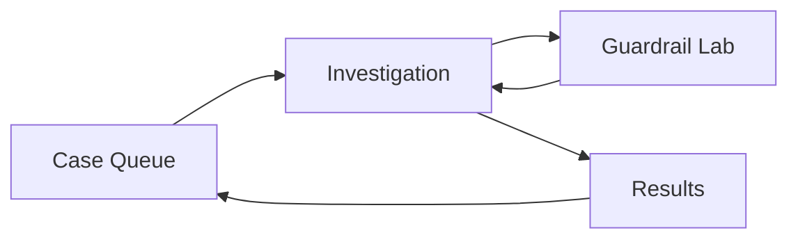
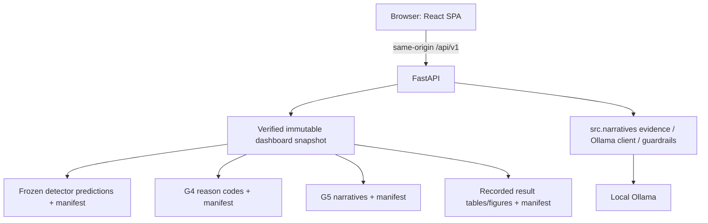

# React + FastAPI Demo Dashboard Specification

**Project:** Credit Card Fraud Detection using a Hybrid Autoencoder-XGBoost Model with Local LLM Explanations  
**Date:** 2026-07-13  
**Status:** Approved design; implementation scheduled as CP2 Task 7.4  
**Audience:** project author, implementation agents, supervisor, examiner-demo rehearsal reviewers  
**Related plan:** `docs/plans/2026-07-13-cp2-implementation-plan.md`

## 1. Executive decision

The live demonstration will use a **React + TypeScript + Vite** single-page application backed by **FastAPI**. FastAPI is the only production server: after the frontend is built, it serves both the JSON API and the React assets from one loopback process.

The dashboard is a read-only presentation and investigation layer. It consumes frozen detector, G4, G5, and report artifacts; it does not train models, select thresholds, recompute reported metrics, regenerate SHAP explanations, or write to experiment directories.

The dashboard's central claim is:

> The local LLM may translate only the model evidence supplied to it. If the narrative contradicts that evidence, introduces unsupported content, breaks the required format, or cannot be generated, the system rejects it and falls back to deterministic reason codes.

## 2. Goals and success criteria

### 2.1 Product goals

1. Let an examiner follow one flagged transaction from detector output to SHAP evidence, narrative, guardrail decision, and fallback.
2. Make the difference between a recorded experimental result and a live replay impossible to miss.
3. Demonstrate guardrail failures with deterministic, repeatable attacks against the real validation function.
4. Continue to provide a complete recorded demonstration when Ollama or the network is unavailable.
5. Make every recorded number and text artifact traceable to a verified frozen run.
6. Present negative evidence honestly, including a real model error or uncertainty case.

### 2.2 Demo success criteria

- The app starts from one production command after dependencies are installed and the Vite build exists.
- The four primary workflows work with Ollama stopped.
- The examiner can understand the main safety mechanism within five minutes.
- A direction flip, unlisted-feature injection, and template corruption each fail the expected guardrail and activate fallback.
- An Ollama timeout is displayed as a controlled degraded state rather than an application failure.
- No live action changes `experiments/runs/` or reported result artifacts.
- All production assets are local; the demo does not require internet access.

## 3. Non-goals

The first version will not include:

- authentication, accounts, or roles;
- CSV upload or arbitrary run-path selection in the browser;
- model training, hyperparameter tuning, threshold adjustment, or what-if scoring;
- real-time transaction streaming;
- cloud deployment or public internet exposure;
- mobile-specific layouts;
- server-side rendering, SEO, or a full-stack React framework;
- a complete SHAP waterfall unless G4 later produces a complete provenance-linked local explanation artifact;
- animations or visual effects that do not improve examiner understanding;
- a UI component framework or charting dependency unless implementation evidence shows it is necessary.

## 4. Research-integrity contract

### 4.1 Recorded mode

Recorded mode displays only artifacts generated by frozen experiment runs. It is the default mode and the only mode whose content may be described as an experimental result.

Recorded content includes:

- detector predictions from `predictions.parquet`;
- G4 reason codes from `reason_codes.jsonl`;
- G5 narratives, checks, fallback state, and latency from `narratives.jsonl`;
- G5 faithfulness metrics from `faithfulness.json`;
- detector results tables and report figures generated by Task 7.1.

The browser must not recompute or alter reported metrics.

### 4.2 Live replay mode

Live replay uses the same recorded G4 evidence for a selected case, calls the configured local Ollama model, and then invokes the real `src.narratives.guardrails.validate_narrative()` implementation.

Every live result must display:

- `Live replay`;
- `Demo-only; not a reported G5 result`;
- generation latency or unavailability reason;
- `reported: false` in the API response;
- the guardrail result and deterministic fallback state.

Live output is ephemeral, uses `Cache-Control: no-store`, and is never written under `experiments/runs/`.

### 4.3 Historical labels

The `y_true` value is historical ground truth used for evaluation. It was not available to the detector at prediction time. Wherever it appears, the UI must label it **Evaluation-only ground truth**.

### 4.4 Language constraints

- Use “privacy-conscious local deployment” or “local explanation architecture with data minimization.”
- Do not claim that the system is proven privacy-preserving.
- Use “SHAP contribution” or “pushes the model output toward fraud/legitimate,” not causal language.
- Do not call a top-k contribution chart a waterfall.
- Do not use “outperforms” unless the displayed logged metrics support the statement.

## 5. Users and presentation context

### 5.1 Primary user

The primary user is the project author presenting to a supervisor or examiner on a laptop connected to a projector. The presenter must be able to move through a rehearsed story without typing case IDs or navigating the filesystem.

### 5.2 Secondary user

A technical reviewer may explore other flagged cases, inspect provenance, compare recorded and live results, and challenge the guardrails.

### 5.3 Environmental assumptions

- Desktop or laptop viewport, normally 1280×720 or larger.
- Local Python, Node dependencies, frontend build, and final experiment artifacts have been prepared.
- Ollama may be available or unavailable.
- Internet access must not be required.

## 6. Demonstration narrative

### 6.1 Five-minute core flow

1. **Open Case Queue:** explain that cases are already scored by the frozen detector and sorted by recorded risk score.
2. **Open a faithful case:** show the detector result and the evaluation-only label.
3. **Read the evidence:** show the top recorded SHAP contributions and standardized reason codes.
4. **Inspect the narrative:** show the recorded G5 narrative and three passed checks.
5. **Open Data sent to LLM:** prove that the payload contains only case ID, risk bucket, feature name, direction, and rank—not raw values, probability, or SHAP magnitude.
6. **Open Guardrail Lab:** flip one direction and run the real validator.
7. **Show rejection and fallback:** the direction badge fails and the system returns deterministic reason codes.
8. **Switch to Ollama unavailable:** show that generation failure still produces a safe fallback.
9. **Open Results:** separate detector performance from explanation/faithfulness metrics.

### 6.2 Extended flow

Add a real model error or uncertainty case. Explain that the historical label is legitimate even though the detector flagged the case. This demonstrates honest error analysis and avoids presenting the model as infallible.

### 6.3 Curated scenarios

The dashboard configuration names curated case IDs, but the backend validates their predicates before startup:

| Scenario | Required predicate |
|---|---|
| Faithful recorded case | G4 record exists; G5 narrative exists; format, grounding, and direction checks all passed; no recorded fallback |
| Real error/uncertainty case | Prefer a flagged false positive (`pred=1`, `y_true=0`); if none exists, use another explicitly described real error or near-threshold case |
| Attack-compatible case | Has a valid evidence record and a faithful base narrative that can be deterministically mutated |
| Ollama unavailable | No case predicate; simulated by stopping Ollama or a test adapter timeout |

No scenario may be fabricated. If a configured predicate is false, validation fails with a message explaining how to select a valid case.

## 7. Information architecture

The application uses four top-level routes rather than five equal tabs. Case detail and narrative belong in one investigation workspace because they are parts of the same reasoning chain.



### 7.1 Global application shell

The shell appears on every route and contains:

- project title and compact pipeline label;
- top navigation: Queue, Guardrail Lab, Results;
- Recorded / Live Replay mode control;
- Ollama status: Available, Unavailable, or Checking;
- artifact readiness status;
- selected case ID;
- provenance drawer;
- Reset demo control that returns to the configured starting scenario.

The mode control changes only the narrative panel. Detector scores, historical labels, reason codes, and recorded results remain frozen.

## 8. Screen specifications

### 8.1 Case Queue — `/queue`

**Purpose:** orient the examiner and select a recorded flagged transaction.

**Primary content:**

- curated scenario cards at the top;
- searchable/filterable flagged-case table;
- default sorting by recorded score descending;
- row click opens `/cases/:caseId`.

**Table columns:**

| Column | Meaning |
|---|---|
| Case | Stable recorded `case_id` |
| Risk | Recorded G4 risk bucket |
| Score | Frozen detector score, clearly labelled as model score |
| Detector | Flagged / not flagged; the default queue contains flagged cases |
| Evaluation-only ground truth | Fraud / Legitimate |
| Top reason | Rank-1 recorded reason code |
| Recorded narrative | Passed / Fallback / Unavailable |

**Filters:** risk bucket, evaluation-only label, recorded fallback state. Filters must be deterministic and reflected in the URL query string when practical.

**States:**

- loading skeleton;
- no matching filtered cases;
- artifact unavailable, which is a startup failure in production rather than an empty table;
- deep-link recovery after refresh.

### 8.2 Investigation — `/cases/:caseId`

**Purpose:** connect detector output, evidence, narrative, validation, and fallback in one view.

**Desktop layout:** 60/40 two-column workspace.

#### Left: detector and evidence

- risk bucket and detector status;
- recorded score;
- validation-selected threshold, if present in the run manifest;
- evaluation-only ground truth;
- plain-language outcome such as “Flagged false positive” where supported;
- “Top recorded SHAP contributions” diverging bar chart;
- reason-code table with feature, direction, rank, and optional displayed SHAP magnitude.

Positive contributions use the risk-increasing colour; negative contributions use the risk-decreasing colour. Direction is also written as text and icon so colour is never the only signal.

#### Right: narrative and guardrails

- Recorded / Live Replay selector state;
- narrative text rendered as plain text, never injected HTML;
- format, grounding, and direction badges;
- overall Accepted / Fallback state;
- fallback reason;
- deterministic fallback text;
- expandable “Data sent to LLM” disclosure;
- provenance link.

The live button is labelled **Generate live replay** rather than “Run model,” because the detector and evidence are not recomputed.

#### Data-minimization disclosure

The disclosure explicitly shows that the LLM receives:

- case identifier;
- coarse risk bucket;
- reason-code feature names;
- direction;
- rank.

It explicitly states that the LLM does not receive:

- the raw transaction row;
- exact feature values;
- detector probability or score;
- SHAP magnitudes;
- the historical label.

### 8.3 Guardrail Lab — `/guardrails`

**Purpose:** make validation behaviour observable and repeatable.

**Controls:**

- attack-compatible case selector;
- preset selector;
- Run validation button;
- Reset control.

**Presets:**

| Preset | Transformation | Expected result |
|---|---|---|
| Direction flip | Change one listed feature from increases to decreases risk, or vice versa | Direction `FAIL`; fallback active |
| Unlisted feature | Inject a known feature absent from the case evidence | Grounding `FAIL`; fallback active |
| Template corruption | Remove or rename a required narrative section | Format `FAIL`; fallback active |

The server constructs mutations deterministically. The browser cannot submit arbitrary narrative text in v1.

**Output:**

- original faithful narrative;
- tampered narrative;
- side-by-side difference highlighting;
- three structured check states;
- concise reason for each failure;
- deterministic fallback output;
- statement that the real `validate_narrative()` implementation produced the result.

Failed states use colour, icon, text, and explanation. A red badge alone is insufficient.

### 8.4 Results — `/results`

**Purpose:** summarize the research without mixing detector and explanation stages.

#### Detector performance section

Contains G0, G1, G2, G3, G6, and G7 only. Display the metrics required by `AGENTS.md`, subject to what Task 7.1 records:

- AUC-PR;
- ROC-AUC;
- precision;
- recall;
- F1;
- false positives and false negatives;
- Precision@100 and Recall@100;
- inference time;
- mean ± standard deviation for multi-seed results.

#### Explanation and narrative section

Contains G4/G5 evidence and faithfulness information separately:

- number of explained flagged cases;
- compliance/format rate;
- grounding rate;
- direction-consistency rate;
- fallback rate;
- Ollama-unavailable count;
- mean narrative latency;
- relevant artifact provenance.

#### Figures

The PR curve is the recorded Task 7.1 report figure. The frontend does not recompute it. The figure includes an accessible caption and a link to the corresponding data table view.

## 9. Visual design system

### 9.1 Design direction

The interface should resemble a calm investigation console, not a banking marketing site or a generic template dashboard. It should be evidence-dense, restrained, and readable on a projector.

### 9.2 Colour tokens

| Token | Value | Use |
|---|---:|---|
| Canvas | `#F4F7FA` | application background |
| Surface | `#FFFFFF` | panels and tables |
| Ink | `#0B1F33` | primary text |
| Muted | `#5E6B78` | secondary text |
| Border | `#D9E1E8` | separators |
| Risk up | `#C2413B` | fraud-increasing contribution / failure |
| Risk down | `#2563A6` | legitimate-increasing contribution |
| Pass | `#2F7D5A` | passed check |
| Warning | `#B7791F` | degraded/unavailable state |
| Selected | `#2F6FED` | focus and selected navigation |

Colour combinations must meet WCAG AA contrast for normal text. Status meaning is always repeated in text.

### 9.3 Typography

- Primary: Source Sans 3, bundled locally if used.
- Monospace: IBM Plex Mono for IDs, hashes, and structured evidence, bundled locally if used.
- Fallback: system UI and system monospace stacks.
- No CDN font requests.

### 9.4 Layout and components

- 8px spacing scale.
- 6–8px corner radius.
- Clear 1px borders; minimal shadow.
- Sticky application header; route content scrolls normally.
- Tables use sticky headers where helpful.
- Buttons use verbs: Open case, Generate live replay, Run validation, Reset demo.
- Animation is limited to short state transitions and respects `prefers-reduced-motion`.

### 9.5 Responsive target

The primary target is 1280×720 and larger. At 1024px width, Investigation may stack its columns. Mobile optimization is explicitly out of scope, but no content should become unreachable at a narrow desktop window.

## 10. Technical architecture



### 10.1 Production topology

- FastAPI binds to `127.0.0.1` by default.
- API is versioned under `/api/v1`.
- Vite produces hashed assets under `app/frontend/dist/`.
- FastAPI serves API routes before SPA fallback.
- The app does not require production CORS because the browser uses the same origin.

### 10.2 Development topology

- Vite development server proxies `/api` to local FastAPI.
- FastAPI may run with reload during development.
- This two-process topology is not used during the examiner demo.

### 10.3 Read-only snapshot

FastAPI lifespan startup performs:

1. parse `configs/dashboard.yaml`;
2. load exact configured manifests and required artifacts;
3. verify hashes and source-chain links;
4. validate stable case joins and curated scenarios;
5. load recorded results into an immutable application snapshot;
6. check whether the frontend build exists;
7. start serving only if all required recorded artifacts are valid.

Artifacts are not hot-reloaded. Changing the dashboard configuration or runs requires a server restart.

## 11. Proposed source layout

```text
app/
  __init__.py
  backend/
    __init__.py
    server.py
    settings.py
    schemas.py
    artifacts.py
    live.py
    attack_presets.py
  frontend/
    package.json
    package-lock.json
    vite.config.ts
    tsconfig.json
    src/
      main.tsx
      App.tsx
      api/
        client.ts
        types.ts
      components/
      pages/
        CaseQueue.tsx
        Investigation.tsx
        GuardrailLab.tsx
        Results.tsx
      styles/
        tokens.css
        global.css
    e2e/
      dashboard.spec.ts
configs/
  dashboard.yaml
tools/
  validate_dashboard.py
tests/
  app/
    fixtures/
    test_artifacts.py
    test_api.py
    test_live.py
    test_attack_presets.py
```

## 12. Dependencies

### 12.1 Python

Runtime additions:

- `fastapi`
- `uvicorn`

Development/test addition:

- `httpx` for FastAPI test clients.

The production live narrative path continues to use the existing `requests`-based `src.narratives.llm_client` unless that module is deliberately migrated with its own regression tests.

### 12.2 Frontend

Runtime:

- React;
- React DOM;
- React Router.

Development/test:

- TypeScript;
- Vite;
- Vitest;
- React Testing Library;
- Playwright;
- ESLint.

Use npm with a committed `package-lock.json`. Do not commit `node_modules/` or the generated `dist/` directory.

## 13. Upstream artifact contracts

Task 7.4 depends on these contracts being implemented before final runs.

### 13.1 Stable case identity

- Create `case_id` from the original CSV row position immediately after load and before deduplication/splitting.
- Preserve it through train/validation/test metadata.
- Explicitly exclude it from preprocessing and model feature matrices.
- Persist it in `predictions.parquet`, G4 records, and G5 records.
- Join stages by `case_id`, never by DataFrame position or temporary index.

### 13.2 Canonical run manifest

Detector, G4, and G5 runs write a versioned `run_manifest.json`. Required fields include:

```json
{
  "schema_version": 1,
  "run_id": "2026-..._g5_seed42",
  "group": "g5",
  "seed": 42,
  "dataset_sha256": "...",
  "config_sha256": "...",
  "split_sha256": "...",
  "git_commit": "...",
  "git_dirty": false,
  "source_runs": [
    {"run_id": "..._g4_seed42", "manifest_sha256": "..."}
  ],
  "source_code_sha256": {
    "src/narratives/evidence.py": "...",
    "src/narratives/guardrails.py": "...",
    "src/narratives/llm_client.py": "..."
  },
  "artifacts": {
    "narratives.jsonl": {"sha256": "...", "rows": 123},
    "faithfulness.json": {"sha256": "..."}
  }
}
```

Detector manifests may omit narrative source hashes. G4 links to the detector manifest; G5 links to the G4 manifest. The full Git revision records run provenance, while exact relevant source hashes determine whether the current demo may claim to use the same narrative/guardrail implementation.

### 13.3 Predictions contract

`predictions.parquet` requires at least:

- `case_id` — unique stable integer;
- `y_true` — evaluation-only label;
- `score` — detector score;
- `pred` — prediction produced with the frozen validation-selected threshold.

Threshold and score semantics are recorded in the manifest/config, not inferred in the browser.

### 13.4 G4 reason-code contract

Each `reason_codes.jsonl` record requires:

```json
{
  "case_id": 123,
  "score": 0.91,
  "y_true": 1,
  "risk_bucket": "High",
  "codes": [
    {
      "feature": "V14",
      "direction": "decreases_risk",
      "rank": 1,
      "shap_value": -1.2
    }
  ]
}
```

The backend verifies G4 `score` and `y_true` against detector predictions for the same `case_id`.

### 13.5 G5 narrative contract

Each `narratives.jsonl` record requires:

- `case_id`;
- serialized evidence;
- raw output or null;
- checks or null;
- fallback boolean;
- final text;
- latency;
- explicit unavailable reason where applicable.

G5 must use distinct run IDs for quick and full runs. A quick run cannot overwrite or share the final run path.

### 13.6 Results manifest

Task 7.1 writes `reports/results_manifest.json` containing:

- schema version;
- exact input run IDs and manifest hashes;
- hashes of `results_main.csv`, `results_summary.csv`, and report figures;
- generation timestamp and tool source hash.

The Results page uses this manifest to prove that displayed tables and figures belong to the configured source chain.

## 14. Dashboard configuration

`configs/dashboard.yaml` is created only after final source artifacts are selected. It contains exact paths; it never uses globs or “latest” selection.

```yaml
schema_version: 1

artifacts:
  detector_run: experiments/runs/<frozen-detector-run>
  g4_run: experiments/runs/<final-g4-run>
  g5_run: experiments/runs/<final-g5-run>
  results_manifest: reports/results_manifest.json

demo_cases:
  faithful_case_id: 123
  error_or_uncertainty_case_id: 456
  attack_case_id: 123

ollama:
  host: http://127.0.0.1:11434
  model: llama3:8b
  timeout_seconds: 20

server:
  host: 127.0.0.1
  port: 8000
```

The browser never receives or changes these filesystem paths.

## 15. API contract

### 15.1 Common response rules

- JSON uses stable snake_case fields.
- Recorded resources include source run IDs and relevant hashes.
- Absolute local paths are never returned.
- Narrative text is returned as text and rendered safely.
- Validation states are `PASS`, `FAIL`, or `NOT_RUN`.
- API errors use a stable `code`, `message`, and optional `details` structure.

### 15.2 `GET /api/v1/health`

Returns application readiness, artifact readiness, frontend build version, and Ollama availability. Artifact invalidity prevents production startup; Ollama unavailability appears as a degraded optional dependency.

### 15.3 `GET /api/v1/provenance`

Returns detector/G4/G5/results run IDs, manifest hashes, source-chain relationships, and relevant source-code compatibility. It does not return absolute paths.

### 15.4 `GET /api/v1/demo-scenarios`

Returns validated scenario shortcuts and human-readable descriptions.

### 15.5 `GET /api/v1/cases`

Query parameters:

- `risk_bucket`;
- `historical_label`;
- `recorded_fallback`;
- `offset`;
- `limit`.

Default ordering is score descending with stable `case_id` tie-breaking.

### 15.6 `GET /api/v1/cases/{case_id}`

Returns the verified joined detector, G4, and G5 recorded view for one case.

### 15.7 `GET /api/v1/results`

Returns two explicit sections:

- `detector_results` for G0/G1/G2/G3/G6/G7;
- `explanation_results` for G4/G5.

### 15.8 `GET /api/v1/figures/{figure_id}`

`figure_id` is an allowlisted enum such as `pr_curves` or `shap_global_bar`. It is not mapped directly from arbitrary user input to a filesystem path.

### 15.9 `POST /api/v1/live/narrative`

Request:

```json
{"case_id": 123}
```

The server retrieves the verified record and invokes the real evidence serializer, Ollama client, guardrail validator, and fallback function.

Successful live response:

```json
{
  "mode": "live_demo",
  "reported": false,
  "case_id": 123,
  "raw_text": "...",
  "final_text": "...",
  "checks": {
    "format": "PASS",
    "grounding": "PASS",
    "direction": "PASS"
  },
  "fallback": false,
  "fallback_reason": null,
  "latency_seconds": 2.4
}
```

Ollama-unavailable response remains HTTP-successful and displayable:

```json
{
  "mode": "live_demo",
  "reported": false,
  "case_id": 123,
  "raw_text": null,
  "final_text": "<deterministic reason-code fallback>",
  "checks": {
    "format": "NOT_RUN",
    "grounding": "NOT_RUN",
    "direction": "NOT_RUN"
  },
  "fallback": true,
  "fallback_reason": "llm_transport_unavailable",
  "latency_seconds": 20.0
}
```

### 15.10 `POST /api/v1/guardrails/demo`

Request:

```json
{"case_id": 123, "preset": "direction_flip"}
```

Allowed presets are `direction_flip`, `unlisted_feature`, and `template_corruption`. The backend returns original text, tampered text, structured checks, failure reasons, and the real fallback result.

## 16. Failure behaviour

| Failure | Behaviour |
|---|---|
| Missing/invalid required artifact | Production startup exits non-zero with actionable validation error |
| Dataset/config/source-chain hash mismatch | Production startup exits non-zero |
| Duplicate/missing/orphan `case_id` | Production startup exits non-zero |
| Relevant narrative source hash mismatch | Startup refuses the “same evaluated system” configuration |
| Missing Vite production build | Startup exits with the exact build command |
| Ollama connection failure/timeout | App remains available; live request returns fallback with `NOT_RUN` checks |
| Recorded case missing narrative | Show recorded fallback/unavailable state if validly recorded; do not invent narrative |
| Invalid curated scenario | Startup validation fails with the predicate that was not satisfied |
| Unknown figure or attack preset | 404/422 without path disclosure or execution |

## 17. Security and privacy-conscious boundaries

- Bind to loopback by default.
- No authentication is required because the product is a local examiner demo, not a deployed multi-user system.
- No upload endpoints.
- No arbitrary filesystem path parameters.
- No shell commands constructed from request input.
- No HTML rendering of model output.
- No external asset/CDN requests in production.
- Browser live requests contain only `case_id`; browser guardrail requests contain only `case_id` and preset.
- The server constructs the LLM evidence payload from verified artifacts.
- Automated tests inspect the outgoing Ollama payload and reject raw rows, exact values, scores, probabilities, historical labels, and SHAP magnitudes.
- Do not log raw narrative payloads at INFO level during presentation unless explicitly needed and safe.

## 18. Accessibility requirements

- Semantic headings, navigation, tables, buttons, and status text.
- Visible keyboard focus.
- Queue → Investigation → Guardrail Lab workflow is keyboard-operable.
- Status never relies on colour alone.
- Charts have textual labels and an accessible tabular alternative where practical.
- Contrast meets WCAG AA.
- Loading and dynamic validation results use appropriate live-region announcements without being disruptive.
- Reduced-motion preference is respected.

## 19. Test strategy

### 19.1 Upstream regression tests

- stable `case_id` survives deduplication and splitting;
- `case_id` is excluded from model features;
- detector predictions persist unique IDs;
- G4/G5 join by ID and reject mismatches;
- canonical manifests contain required hashes;
- adversarial guardrail suite covers bypasses, false rejection, conjunctions, direction flips, unlisted features, template corruption, missing required evidence, and unauthorized numbers;
- any guardrail fix that changes G5 behaviour triggers a new final G5 run.

### 19.2 Backend unit and contract tests

- valid fixture chain loads;
- missing artifact, wrong hash, wrong upstream manifest, duplicate ID, score mismatch, label mismatch, and orphan narrative all fail;
- API responses do not reveal absolute paths;
- cases are sorted and filtered deterministically;
- detector and explanation results remain separate;
- live success calls the real orchestration boundary;
- timeout and connection failure produce `NOT_RUN` fallback responses;
- source experiment hashes and mtimes are unchanged after all API actions;
- arbitrary paths and presets are rejected.

### 19.3 Frontend tests

- routes render all major states;
- Recorded and Live labels cannot be confused;
- evaluation-only label wording is present;
- guardrail badges include state text and reasons;
- Queue filters and deep links work;
- Ollama unavailable state is understandable;
- Results sections cannot place G4/G5 in the detector table;
- keyboard focus and core navigation work.

### 19.4 End-to-end tests

- production build serves through FastAPI;
- Queue → faithful Investigation → Guardrail Lab → Results flow;
- all three attacks activate fallback;
- live success with mocked Ollama;
- live timeout fallback;
- recorded demo works with Ollama stopped;
- no request is made to a non-loopback origin;
- deep-link refresh works;
- exact final artifacts pass a smoke test.

### 19.5 Verification commands

```bash
uv run pytest tests/app
uv run pytest
cd app/frontend
npm ci
npm run test
npm run build
npm run e2e
cd ../..
uv run python tools/validate_dashboard.py --config configs/dashboard.yaml
uv run python -m app.backend.server --config configs/dashboard.yaml
```

## 20. Implementation sequence

1. Introduce stable case identity and upstream manifests before final experiments.
2. Strengthen guardrail tests and implementation before final G5.
3. Generate results manifest with Task 7.1.
4. Resolve relevant Task 7.2 BLOCKER/MAJOR findings.
5. Freeze `configs/dashboard.yaml` against exact final artifacts.
6. Implement artifact fixtures, schemas, validator, and backend snapshot.
7. Implement FastAPI read-only endpoints.
8. Implement live narrative and deterministic attack presets.
9. Build the React shell and custom design tokens against fixture APIs.
10. Implement Queue and Investigation.
11. Implement Guardrail Lab and Results.
12. Build production assets and add SPA serving.
13. Run Python, frontend, Playwright, artifact, offline, and exact-run smoke tests.
14. Feature-freeze and rehearse.

## 21. Timeline and effort

Budget **9–12 focused working days** for the dashboard after the required upstream contracts exist.

| Period | Work |
|---|---|
| W10 | Results, adversarial review, fixes, manifest validation, source-chain freeze |
| W11 | Backend contract, snapshot, API, React shell, Queue |
| W12 | Investigation, Guardrail Lab, Results, live fallback, automated tests |
| W13 | Feature freeze, exact-artifact smoke, at least three rehearsals, report screenshots |
| W14 | Buffer, supervisor feedback, recovery drill, final polish |

Waterfall charts, animation, mobile work, extra tabs, and additional live controls remain optional and cannot delay feature freeze.

## 22. Demo runbook

### 22.1 Preparation

```bash
uv sync
cd app/frontend && npm ci && npm run build && cd ../..
uv run pytest
uv run python tools/validate_dashboard.py --config configs/dashboard.yaml
```

Start Ollama only if live replay will be demonstrated.

### 22.2 Start

```bash
uv run python -m app.backend.server --config configs/dashboard.yaml
```

Open the loopback URL printed by the server.

### 22.3 Recovery

- If Ollama is unavailable, continue in Recorded mode and explicitly demonstrate the fallback state.
- If the server refuses artifact validation, do not bypass validation; switch to the last rehearsed valid configuration or diagnose the stated mismatch.
- If the React build is missing, run the printed `npm ci && npm run build` instruction.
- Keep screenshots or a short screen recording only as a presentation backup, not as evidence replacing the live system.

## 23. Rehearsal checklist

- [ ] Cold start with network disabled.
- [ ] Recorded four-route flow with Ollama disabled.
- [ ] Live faithful generation with Ollama enabled.
- [ ] Direction-flip attack.
- [ ] Unlisted-feature attack.
- [ ] Template-corruption attack.
- [ ] Ollama timeout/unavailable fallback.
- [ ] Real error/uncertainty case explanation.
- [ ] Provenance drawer explanation.
- [ ] Results detector/explanation separation.
- [ ] Projector readability at the actual room resolution.
- [ ] Keyboard navigation and visible focus.
- [ ] Recovery from browser refresh and direct case URL.
- [ ] Source artifact hashes unchanged after rehearsal.
- [ ] Three complete timed runs after feature freeze.

## 24. Definition of done

The dashboard is complete only when:

1. stable case identity and canonical detector/G4/G5/results manifests exist;
2. guardrail adversarial tests pass before the final G5 run;
3. relevant Task 7.2 findings are resolved;
4. `configs/dashboard.yaml` selects exact verified artifacts;
5. production starts with one FastAPI command after install/build preparation;
6. all four routes work offline without Ollama;
7. live output is non-persistent and visibly demo-only;
8. the real narrative and guardrail modules are used and their relevant hashes match final G5;
9. all three attacks and Ollama failure produce the expected fallback behaviour;
10. detector and explanation metrics remain separated and provenance-linked;
11. Python, frontend, build, Playwright, validator, offline, and exact-artifact checks pass;
12. at least three complete rehearsals have been performed after feature freeze.

## 25. References

- React: <https://react.dev/>
- Vite: <https://vite.dev/guide/>
- FastAPI: <https://fastapi.tiangolo.com/>
- Playwright: <https://playwright.dev/>
- Project rules: `AGENTS.md`
- Consensus execution plan: `.omx/plans/2026-07-13-react-fastapi-demo-dashboard.md`
